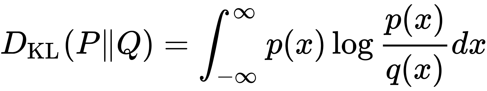
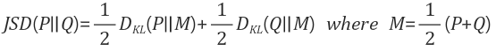
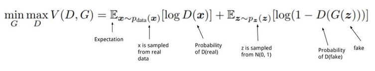
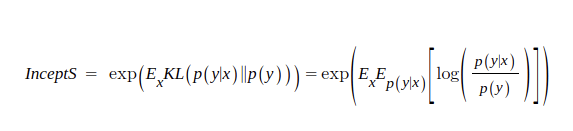

# GAN intro

GAN은 생성기 신경망(Generator network)과 판별기 신경망(discriminator network)이라고 하는 두 가지 신경망으로 구성된 심층 신경만 아키텍처이다.  
## Generator network
기존의 데이터를 사용해 신규 데이터를 생성해 낸다. 기본 목표는 잠재공간(latent space)라고 부르는 무작위 로 생성된 숫자 벡터를 바탕으로 데이터를 생성해 내는 데 있다. 이미지 생성, 텍스트 생성, 오디오 생성, 비디오 생성 등이 이와 같은 목표가 될 수 있다.  
## Discriminator network
진짜 데이터와 Generator가 생성한 데이터 중 어떤게 진짜인지를 구별하는 신경망이다. 들어오는 데이터를 사전에 정의해 둔 범주별로 구분해 두려고 노력한다.
> Discriminator가 구별하지 못하는 지경에 이르게 되는 순간 `내시 균형(Nash equilibrium)`으로 알려진 상태에 도달하게 된다.

## GAN과 관련된 중요한 개념

1. Kullback-Leibler 발산  
relative entropy로도 알려져있다. 두 가지 확률 분포 간의 유사도를 알아내는 데 사용하는 방법이다. 이것은 하나의 확률 분포 p가 두 번째 기대 확률 분포 q와 어떻게 다른지를 측정한다.  
  
p(x)가 q(x)와 같을 때 KL발산은 0으로 최소가 된다.  
KL발산은 비대칭 특성으로 인해, 두 확률 분포 사이의 거리를 측정할 때는 이것을 사용해서는 안된다. 다시 말해서 일종의 거리 계량으로 사용해서는 안 된다는 말이다.

2. Jensen-Shannon 발산
JS발산도 마찬가지로 두 확률 분포 간의 유사도를 측정하는 또 다른 측정 기준이다. information radius나 total divergence to the average라고도 한다. 이 발산은 대칭이며 두 확률 분포 사이의 거리를 측정할 수 있다. 
  

## **내시 균형**
내시 균형은 GAN이 올바르게 작동하게 하는 원리에 대한 설명이다.  
각 플레이어가 다른 플레이어가 기대하는 바를 기반으로 최선의 결과를 얻기 위해 최선의 전략을 고르는 비협력 게임에서 이러한 상태가 나타난다. 

## **목적 함수**
진짜 이미지와 비슷한 이미지를 생성하는 생성기 신경망을 만들기 위해서 우리는 생성기가 생성 된 데이터와 진짜 데이터 간의 유사도를 높이려고 한다. 

두 신경망(Generator, Discriminator)에는 자체 목적 함수들이 있으므로 훈련을 하는 동안에 두 신경망은 각기 자체 목적 함수들을 최소화하려고 한다.  
D(x)는 Generator이고, G(z)는 Discriminator이다. Px는 진짜 데이터 분포이고, Pz는 Discriminator가 생성한 데이터의 분포에 해당하며, E는 예상되는 출력 내용이다.
D(x)는 최대화를 바라고 G(z)는 최소화하기를 바란다. 이 두 목적함수가 내시 균형을 맞추며 정확도가 높아진다.

## 인셉션 점수
인셉션 V3 신경망(pre-trained by imagenet)을 사용해 생성된 이미지와 진짜 이미지의 특징을 추출한다.
인셉션 모델에서 식별하기 쉬운 영상 및 식별된 레이블의 편차가 풍부할 수록 점수가 높도록 설계되어있다.  
GAN에서는 낮은 엔트로피로 결과가 나와야한다. 이는 특정 이미지가 분류가 잘 돼야한다는 점이다.
두 가지 기준을 사용한다.
- 생성된 영상의 품질
- 생성된 영상의 다양성  

  
