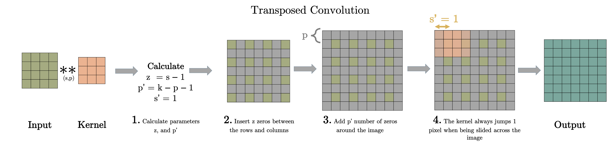
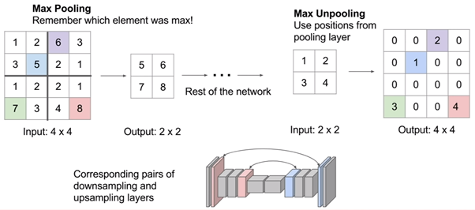

# Auto-encoder(AE)

  
[그림1]  

그림 1에서 확인할 수 있듯, Auto-encoder의 입력과 타깃 도메인이 동일해서 이 모델의 병목 계층(Bottleneck)에도 불구하고 적절하게 인코딩한 다음 품질에 영향을 주지 않고 이미지를 디코딩하는 것을 목표로 한다.  
Auto-encoder는 보통 손실 압축이라고 표현한다. 이미지의 경우, 손실을 cross-entropy loss 또는 L1/L2 손실로 계산될 수 있다.  
> 활용/응용 분야  
> - semantic segmentation  
> - GAN(Generative Adeversarial Network)
> - noise remove
> - super-resolution  
> - image upscaling

병목(bottleneck)으로 인해 encoder는 가능한 많은 정보를 보존하면서 데이터를 압축해야 한다.  
따라서 훈련 데이터 셋이 반복 패턴을 가지고 있다면 네트워크는 인코딩을 개선하기 위해 이 상관관계를 알아내려고 할 것이다.

## 다음은 Dense를 이용한 간단한 MNIST 예제이다.
### 1. 모듈 설치 및 데이터 셋 확인
```python
import tensorflow as tf
import numpy as np
import pandas as pd
import tensorflow_hub as hub
import matplotlib.pyplot as plt
import cv2
```
```python
# Loads the MNIST model built into keras.
(train_X, train_Y), (test_X, test_Y) = tf.keras.datasets.mnist.load_data()
print(train_X.shape, train_Y.shape)
```

Dense 모델을 사용하기 위해서는 다음과 같이 이미지를 `reshape` 해준다.
```python
train_X = train_X.reshape(-1, 28 * 28)
test_X = test_X.reshape(-1, 28 * 28)
```


### 2. 오토인코더 모델 정의

```python
model = keras.models.Sequential()

# encoding layers
model.add(tf.keras.layers.Dense(784, activation='relu', input_shape=(784,)))
model.add(tf.keras.layers.Dense(64, activation='relu'))
model.add(tf.keras.layers.Dense(784, activation='sigmoid'))
```

### 3. 오토인코더 학습
```python
model.fit(X_train, X_train, 
        epochs=300, 
        batch_size=128,
        shuffle=True,
        validation_data=(X_test, X_test),
        callbacks=[tensorboard_cb, checkpoint_cb, early_stopping_cb])
```

# Convolution Auto-encoder
  
## 전치 합성곱(Traspose Convolution)
입력 Tensor는 (2)팽창(dilation) 과정을 거치고 난뒤 예상한 출력에 맞게끔 (3)패딩(padding) 과정을 거치고, 합성곱 연산을 진행한다.  
다소 추상적이지만, 전치 합성곱 계층은 일반적으로 표준 합성곱 계층을 반전시켜 특징 맵의 콘텐츠와 훈련 가능한 필터 사이의 합성곱을 통해 특징 맵의 공간 차원을 증가시키기 위해 사용된다는 점만 기억해도 충분하다.
> 다음과 같은 전치 합성곱 연산은 `tf.layers.conv2d_transpose()`와 `tf.keras.Conv2DTranspose()`를 사용해 인스턴스화 할 수 있다.

## 언풀링(Unpooling), 업샘플링(UpSampling)
MaxPooling, AveragePooling을 반전해서 만든 것이다.
말보다 그림으로 이해하는 게 빠르니 그림으로 이해해보자.  
  
위는 MaxPooling을 반전시킨 Unpooling의 예시이고, AveragePooling을 반전시킨 것은 0대신 같은 값으로 채워주면 된다.  
> UpSampling의 경우, `tf.keras.layers.UpSampling2D()`를 통해 인스턴스화될 수 있다.  
> default 이미지 크지 조정값은 Nearest neighbor interpolation을 사용한다.
> - 최근접 이웃 보간법(defualt): interpolation="nearest"(method=tf.image.ResizeMethod.NEAREST_NEIGHBOR와 호출 방식 동일)    
> - 양산형 보간법 사용시: interpolation="bilinear"(method=tf.image.ResizeMethod.NEAREST_BILINEAR와 호출 방식 동일)

## 팽창된 아트루스 합성곱(Dilated Atrous Convolution)
제공된 feature map을 업샘플링하는 용도로 쓰이지 않는다.  
공간 차원을 희생시키지 않고 합성곱의 수용 영역을 인위적으로 증가시키기 위해 제안된다.  
입력 feature map은 패딩(padding)과정을 거치게 되고, filter는 팽창(dilate)를 거쳐 맵의 크기를 증가시킨다.


## 다음은 Convolution을 이용한 간단한 예제이다.
(위와 곂치는 부분은 건너 뛰었다.)
```python
X_train = np.reshape(X_train, (len(X_train), img_size, img_size, 1))
X_test = np.reshape(X_test, (len(X_test), img_size, img_size, 1))
X_noise = X_train + np.random.normal(loc=.0, scale=.5, size=X_train.shape)
```

```python
model = keras.models.Sequential()

# encoding layers
model.add(keras.layers.Conv2D(128, (3,3), activation='relu', padding='same', input_shape=self.input_shape))
model.add(keras.layers.MaxPooling2D((2,2), padding='same'))
model.add(keras.layers.Conv2D(64, (3,3), activation='relu', padding='same'))
model.add(keras.layers.MaxPooling2D((2,2), padding='same'))
model.add(keras.layers.Conv2D(16, (3,3), activation='relu', padding='same'))
model.add(keras.layers.MaxPooling2D((2,2), padding='same'))
model.add(keras.layers.Conv2D(16, (3,3), activation='relu', padding='same'))
model.add(keras.layers.MaxPooling2D((2,2), padding='same'))

# decoding layers
model.add(keras.layers.Conv2D(16, (3,3), activation='relu', padding='same'))
model.add(keras.layers.UpSampling2D((2,2)))
model.add(keras.layers.Conv2D(16, (3,3), activation='relu', padding='same'))
model.add(keras.layers.UpSampling2D((2,2)))
model.add(keras.layers.Conv2D(64, (3,3), activation='relu', padding='same'))
model.add(keras.layers.UpSampling2D((2,2)))
model.add(keras.layers.Conv2D(128, (3,3), activation='relu'))
model.add(keras.layers.UpSampling2D((2,2)))
model.add(keras.layers.Conv2D(1, (3,3), activation='sigmoid', padding='same'))
```

전체 소스코드는 [baseline_code_AE](https://github.com/dolgogae/baseline_code_AE/blob/master/main.py)에서 확인 가능합니다. 