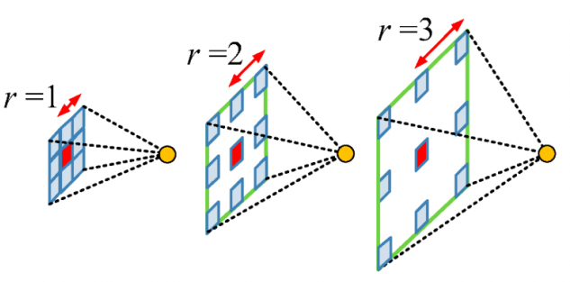
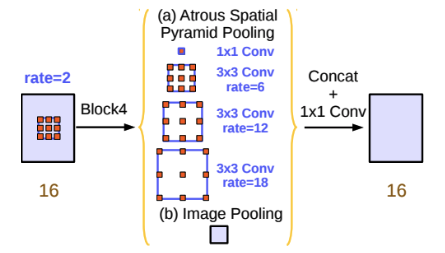
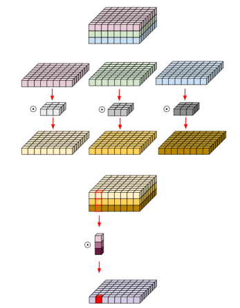
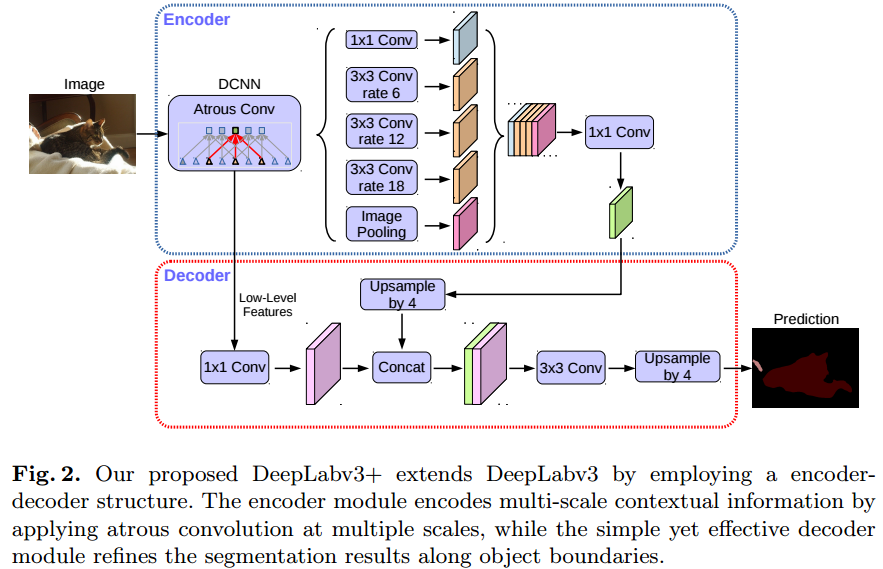

# DeepLab

DeepLab은 atroud convolution을 활용한 Sematic Segmentation 방법이다. 
- DeepLab V1: Atrous convolution을 처음 적용
- DeepLab V2: multi-scale context를 적용하기 위한 Atrous Spatial Pyramid Pooling(ASPP) 기법을 제안
- DeepLab V3: 기존 ResNet 구조에서 Atrous convolution을 활용해 좀 더 Dense한 feature map을 얻는 방법을 제안
- DeepLab V3+: Depthwise Separable Convolution과 Atrous convolution을 결합한 Atrous Separable Convolution의 활용을 제안

위에서 공통적으로 등장하는 Atrous convolution이 있다.  
Atrous convolution이란 기존의 Convolution과는 다르게 필터 내부에 빈 공간을 둔채 작동하게 된다.(빈 공간을 나타내는 변수: r). r이 커질수록 빈 공간이 넓어지는 것을 뜻한다.  
  

**이러한 Atrous Convolution을 활용함으로써 얻을 수 있는 이점은 기존 convolution과 동일한 양의 파라미터와 계산량을 유지하면서도, field of view(한 픽셀이 볼 수 있는 영역)을 크게 가져갈 수 있다는 점이다.**  

## DeepLab V2
ASPP(Atrous Spatial Pyramid Pooling): rate(빈 공간의 크기)가 다른 Atrous Convolution 필터를 병렬로 적용한 뒤, 이를 다시 합쳐주는 기법.  
ASPP를 사용하게 되면 multi-scale context를 모델로서 직접 구현하게 되어 정확한 Semantic Segmentation을 가능하게 한다는 것이다.  


## DeepLab V3
Depthwise Convolution: Channel의 축을 모두 분리시킨 뒤, Channel 축 길이를 항상 1로 가지는 여러 개의 Convolution 필터로 대체 시킨 연산  
Depthwise Sparable Convolution: Depthwise Convolution의 결과로 나온 map에 대해서 1x1xC 필터를 적용한 연산  

Depthwise Sparable Convolution을 수행하는 이유는 기존의 Convolution과 유사한 성능을 보이면서도 사용하는 파라미터수와 연산량을 획기적으로 줄일 수 있기 때문이다.  
  

기존의 Convolution 연산에서 sepatial과 channel연산을 분리한 연산으로 두개 차원의 연산을 모두 수행해 결과는 비슷하지만 연산량 면에서는 많은 이득을 볼 수 있다.  

## DeepLab V3+
U-Net과 유사한 incoder-decoder 형식을 가지고 있고, encoder에는 DeepLab V3를 사용한다.(Deepwise Sparable Convolution연산) 그리고 decoder에서도 U-Net과 유사하게 *연결*을 활용해준다.  

||DeepLab V3|DeepLab V3+|  
|---|-----|-----|
|Encoder|ResNet with Atrous Conv|Xception  
|Middle|ASP|ASPP  
|Decoder|Bilinear UpSampling|U-Net Style  

DeepLab V3+와는 다음과 같은 차이점을 확인 할 수 있다.  
  

## Tensorflow 패키지를 이용한 구현

Tensorflow에서는 DeepLab을 간단하게 구현 할 수 있도록 지원해준다.
[DeepLab을 구현한 오픈 소스](https://github.com/tensorflow/models/blob/master/research/deeplab)

```python
# 해당 소스코드를 통해서 pre-train된 deeplab 모델을 가져올 수 있다.
MODEL_NAME = 'mobilenetv2_coco_voctrainaug'  # @param ['mobilenetv2_coco_voctrainaug', 'mobilenetv2_coco_voctrainval', 'xception_coco_voctrainaug', 'xception_coco_voctrainval']

_DOWNLOAD_URL_PREFIX = 'http://download.tensorflow.org/models/'
_MODEL_URLS = {
    'mobilenetv2_coco_voctrainaug':
        'deeplabv3_mnv2_pascal_train_aug_2018_01_29.tar.gz',
    'mobilenetv2_coco_voctrainval':
        'deeplabv3_mnv2_pascal_trainval_2018_01_29.tar.gz',
    'xception_coco_voctrainaug':
        'deeplabv3_pascal_train_aug_2018_01_04.tar.gz',
    'xception_coco_voctrainval':
        'deeplabv3_pascal_trainval_2018_01_04.tar.gz',
}
_TARBALL_NAME = 'deeplab_model.tar.gz'

model_dir = tempfile.mkdtemp()
tf.gfile.MakeDirs(model_dir)

download_path = os.path.join(model_dir, _TARBALL_NAME)
print('downloading model, this might take a while...')
urllib.request.urlretrieve(_DOWNLOAD_URL_PREFIX + _MODEL_URLS[MODEL_NAME],
                   download_path)
print('download completed! loading DeepLab model...')

MODEL = DeepLabModel(download_path)
```

다음과 같이 불러온 모델을 이용해 Segmantation을 할 수 있다.
```python
class DeepLabModel(object):
  """Class to load deeplab model and run inference."""

  INPUT_TENSOR_NAME = 'ImageTensor:0'
  OUTPUT_TENSOR_NAME = 'SemanticPredictions:0'
  INPUT_SIZE = 513
  FROZEN_GRAPH_NAME = 'frozen_inference_graph'

  def __init__(self, tarball_path):
    """Creates and loads pretrained deeplab model."""
    self.graph = tf.Graph()

    graph_def = None
    # Extract frozen graph from tar archive.
    tar_file = tarfile.open(tarball_path)
    for tar_info in tar_file.getmembers():
      if self.FROZEN_GRAPH_NAME in os.path.basename(tar_info.name):
        file_handle = tar_file.extractfile(tar_info)
        graph_def = tf.GraphDef.FromString(file_handle.read())
        break

    tar_file.close()

    if graph_def is None:
      raise RuntimeError('Cannot find inference graph in tar archive.')

    with self.graph.as_default():
      tf.import_graph_def(graph_def, name='')

    self.sess = tf.Session(graph=self.graph)

  def run(self, image):
    """Runs inference on a single image.
    Args:
      image: A PIL.Image object, raw input image.
    Returns:
      resized_image: RGB image resized from original input image.
      seg_map: Segmentation map of `resized_image`.
    """
    width, height = image.size
    resize_ratio = 1.0 * self.INPUT_SIZE / max(width, height)
    target_size = (int(resize_ratio * width), int(resize_ratio * height))
    resized_image = image.convert('RGB').resize(target_size, Image.ANTIALIAS)
    batch_seg_map = self.sess.run(
        self.OUTPUT_TENSOR_NAME,
        feed_dict={self.INPUT_TENSOR_NAME: [np.asarray(resized_image)]})
    seg_map = batch_seg_map[0]
    return resized_image, seg_map
```