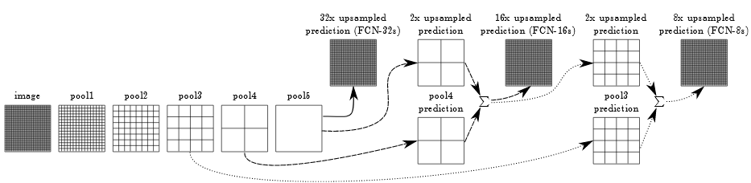

# FCN(Fully Connetcted Network)

### FCN에 들어가기 앞서, Semantic Segmentaion은 특징 추출기(classification)의 마지막 feature map에서 특정 class가 분포하기 때문에 그것을 원래 이미지로 확장시켜 그 부분에 해당 class가 있는 것을 예측하고 얼마나 정확한 classification으로 얼마나 정보를 유실하지 않게 하는 것이 목표인 것 같다.  
  


VGG-16아키텍쳐에 기반해 마지막 밀집 계층을 1*1 합성곱 계층으로 대채해 구성된다.
- 특징 추출을 위한 CNN을 효율적인 인코더로 사용할 수 있는 방법
- 오토 인코더에서 나온 확장 연산을 사용해 CNN의 feature map을 효율적으로 업샘플링하고 디코딩하는 방법  
  
 VGG-16을 특징 추출기로 재사용할 것을 제안했다. 이후, 마지막 블록의 특징 맵을 디코딩하기 위해 분류 헤드(dense layer)를 제거하고 합성곱 계층으로 대체한다. 그런 다음 최종 계층으로 데이터를 입력 형상으로 업샘플링하기 위한 전치 합성곱을 적용한다. (VGG를 통해 
공간 차원이 32로 나눠졌기 때문에 보폭을 s=32로 설정: `FCN-32s Architecture`)

```python
# 기존의 VGG16과 동일하게 특징 추출기를 사용

## Block 1
x = Conv2D(2**b, (3, 3), activation='elu', padding='same', name='block1_conv1')(s)
x = Conv2D(2**b, (3, 3), activation='elu', padding='same', name='block1_conv2')(x)
x = MaxPooling2D((2, 2), strides=(2, 2), name='block1_pool')(x)
f1 = x

# Block 2
x = Conv2D(2**(b+1), (3, 3), activation='elu', padding='same', name='block2_conv1')(x)
x = Conv2D(2**(b+1), (3, 3), activation='elu', padding='same', name='block2_conv2')(x)
x = MaxPooling2D((2, 2), strides=(2, 2), name='block2_pool')(x)
f2 = x

# Block 3
x = Conv2D(2**(b+2), (3, 3), activation='elu', padding='same', name='block3_conv1')(x)
x = Conv2D(2**(b+2), (3, 3), activation='elu', padding='same', name='block3_conv2')(x)
x = Conv2D(2**(b+2), (3, 3), activation='elu', padding='same', name='block3_conv3')(x)
x = MaxPooling2D((2, 2), strides=(2, 2), name='block3_pool')(x)
pool3 = x

# Block 4
x = Conv2D(2**(b+3), (3, 3), activation='elu', padding='same', name='block4_conv1')(x)
x = Conv2D(2**(b+3), (3, 3), activation='elu', padding='same', name='block4_conv2')(x)
x = Conv2D(2**(b+3), (3, 3), activation='elu', padding='same', name='block4_conv3')(x)
pool4 = MaxPooling2D((2, 2), strides=(2, 2), name='block4_pool')(x)

# Block 5
x = Conv2D(2**(b+3), (3, 3), activation='elu', padding='same', name='block5_conv1')(pool4)
x = Conv2D(2**(b+3), (3, 3), activation='elu', padding='same', name='block5_conv2')(x)
x = Conv2D(2**(b+3), (3, 3), activation='elu', padding='same', name='block5_conv3')(x)
pool5 = MaxPooling2D((2, 2), strides=(2, 2), name='block5_pool')(x)

# 첫번째 전치 합성곱을 적용한 layer
# pool4를 skip connection으로 적용
pool4_n = Conv2D(n_classes, (1, 1), activation='elu', padding='same')(pool4)
u2 = Conv2DTranspose(n_classes, kernel_size=(2, 2), strides=(2, 2), padding='same')(conv7)
u2_skip = Add()([pool4_n, u2])
```

하지만 최종 계층의 보폭이 크면 마지막 VGG블록의 특징에 풍부한 정보를 유실하는 현상이 일어난다. 따라서 마지막 계층의 전치 보폭이 2밖에 되지 않는 전치 계층으로 대체되 결과 텐서가 네 번째 블록의 feature map과 동일한 차원을 갖게 된다. skip connection을 사용해 두 텐서에서 나온 특징이 서로 합쳐진다.(마지막 결과를 s=16인 전치 합성곱 사용: `FCN-16s Architecture`)  

```python
# 두번째 전치 합성곱을 적용한 layer
# pool3를 skip connection으로 적용
pool3_n = Conv2D(n_classes, (1, 1), activation='elu', padding='same')(pool3)
u4 = Conv2DTranspose(n_classes, kernel_size=(2, 2), strides=(2, 2), padding='same')(u2_skip)
u4_skip = Add()([pool3_n, u4])
```

마지막으로 동일한 위와 동일한 절차를 한번 더 거치면 마지막 feature map의 정보를 많이 유실하지 않은 segmentation 결과를 얻을 수 있다.(마지막 전치 합성곱에서 보폭은 s=8을 사용: `FCN-8s Architecture`)

```python
# 마지막 layer는 stride(보폭)을 8로 해서 최종 결과 값으 크기를 맞춰준다.
o = Conv2DTranspose(n_classes, kernel_size=(8, 8), strides=(8, 8), padding='same',
                    activation=self.final_act)(u4_skip)
```

skip connection의 역할은 해당 논문에서 그 전의 layer의 정보도 같이 사용하자는 아이디어에서 나왔다. 왜냐하면 이전의 layer는 현재 layer가 가지는 정보보다 더 디테일한 정보를 가지고 있기 때문에 복원하는 데에 있어서 더 효율적이라는 것이다.  

