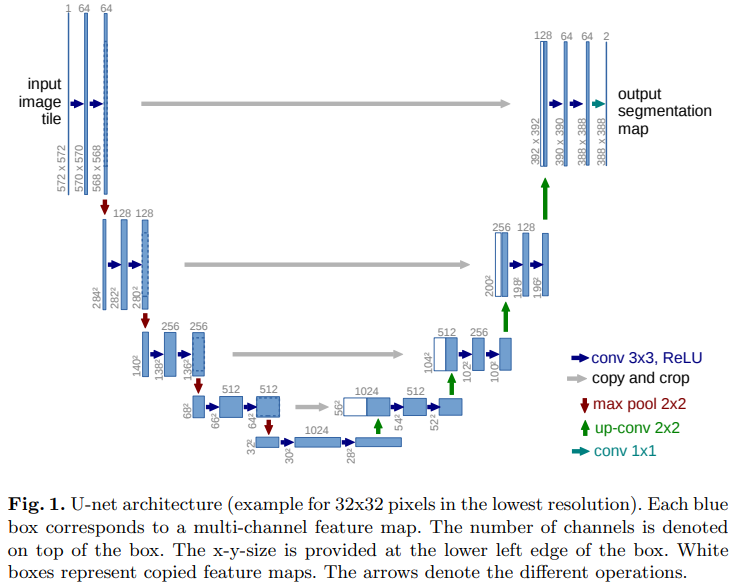
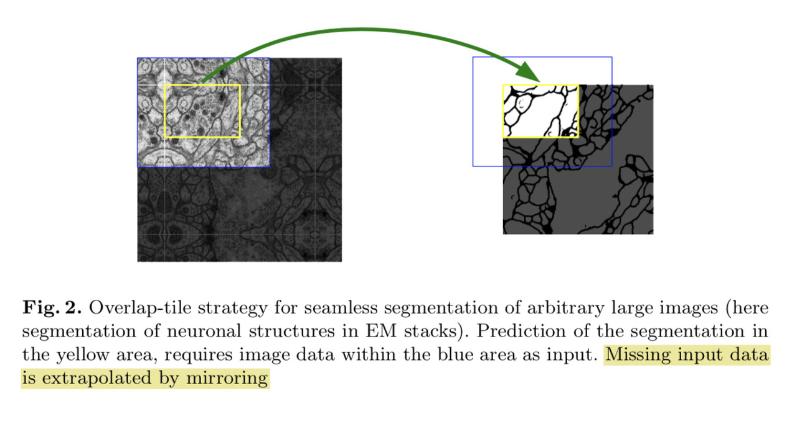

# U-Net

U-Net은 FCN과 여러 속성을 공유한다. 특징 깊이를 증가시키면서 공간 차원은 축소시키는 다중블록 축소 인코더와 이미지 해상도를 복
원하는 확장 디코더로 구성된다. 또한, FCN처럼 skip connection은 인코딩 블록을 그에 대응하는 디코딩 블록과 연결한다.  
## FCN과 다른점 2가지
- FCN-8과는 달리 *대칭형*이다.
- skip connection에서 나온 feature map은 덧셈 대신 *연결*(채널 축을 따라)을 통해 결합된다.



```python
# 전체적인 구조는 대칭형임을 확인 할 수 있다.
i = Input((imshape[0], imshape[1], imshape[2]))
s = Lambda(lambda x: preprocess_input(x)) (i)

c1 = Conv2D(2**b, (3, 3), activation='elu', kernel_initializer='he_normal', padding='same') (s)
c1 = Dropout(0.1) (c1)
c1 = Conv2D(2**b, (3, 3), activation='elu', kernel_initializer='he_normal', padding='same') (c1)
p1 = MaxPooling2D((2, 2)) (c1)

c2 = Conv2D(2**(b+1), (3, 3), activation='elu', kernel_initializer='he_normal', padding='same') (p1)
c2 = Dropout(0.1) (c2)
c2 = Conv2D(2**(b+1), (3, 3), activation='elu', kernel_initializer='he_normal', padding='same') (c2)
p2 = MaxPooling2D((2, 2)) (c2)

c3 = Conv2D(2**(b+2), (3, 3), activation='elu', kernel_initializer='he_normal', padding='same') (p2)
c3 = Dropout(0.2) (c3)
c3 = Conv2D(2**(b+2), (3, 3), activation='elu', kernel_initializer='he_normal', padding='same') (c3)
p3 = MaxPooling2D((2, 2)) (c3)

c4 = Conv2D(2**(b+3), (3, 3), activation='elu', kernel_initializer='he_normal', padding='same') (p3)
c4 = Dropout(0.2) (c4)
c4 = Conv2D(2**(b+3), (3, 3), activation='elu', kernel_initializer='he_normal', padding='same') (c4)
p4 = MaxPooling2D(pool_size=(2, 2)) (c4)

c5 = Conv2D(2**(b+4), (3, 3), activation='elu', kernel_initializer='he_normal', padding='same') (p4)
c5 = Dropout(0.3) (c5)
c5 = Conv2D(2**(b+4), (3, 3), activation='elu', kernel_initializer='he_normal', padding='same') (c5)

u6 = Conv2DTranspose(2**(b+3), (2, 2), strides=(2, 2), padding='same') (c5)
# 밑에서 볼 수 있듯이 add 연산이 아닌 concatenate로 연결 연산을 볼 수 있다.
u6 = concatenate([u6, c4])
c6 = Conv2D(2**(b+3), (3, 3), activation='elu', kernel_initializer='he_normal', padding='same') (u6)
c6 = Dropout(0.2) (c6)
c6 = Conv2D(2**(b+3), (3, 3), activation='elu', kernel_initializer='he_normal', padding='same') (c6)

u7 = Conv2DTranspose(2**(b+2), (2, 2), strides=(2, 2), padding='same') (c6)
u7 = concatenate([u7, c3])
c7 = Conv2D(2**(b+2), (3, 3), activation='elu', kernel_initializer='he_normal', padding='same') (u7)
c7 = Dropout(0.2) (c7)
c7 = Conv2D(2**(b+2), (3, 3), activation='elu', kernel_initializer='he_normal', padding='same') (c7)

u8 = Conv2DTranspose(2**(b+1), (2, 2), strides=(2, 2), padding='same') (c7)
u8 = concatenate([u8, c2])
c8 = Conv2D(2**(b+1), (3, 3), activation='elu', kernel_initializer='he_normal', padding='same') (u8)
c8 = Dropout(0.1) (c8)
c8 = Conv2D(2**(b+1), (3, 3), activation='elu', kernel_initializer='he_normal', padding='same') (c8)

u9 = Conv2DTranspose(2**b, (2, 2), strides=(2, 2), padding='same') (c8)
u9 = concatenate([u9, c1], axis=3)
c9 = Conv2D(2**b, (3, 3), activation='elu', kernel_initializer='he_normal', padding='same') (u9)
c9 = Dropout(0.1) (c9)
c9 = Conv2D(2**b, (3, 3), activation='elu', kernel_initializer='he_normal', padding='same') (c9)

o = Conv2D(n_classes, (1, 1), activation=final_act) (c9)
```

대칭형과 연결 연산으로 인해 FCN보다 간단하게 구현이 가능함을 확인 할 수 있다.  

U-Net의 main idea는 Overlap-tile 기법을 사용하여 원할한 segmentaion이 가능하도록 했다는 것이다.   
  
그림에서 확인 가능하듯이 Blue tile과 Yellow tile이 Overlap 되어 그것에 기반해 segmentation을 예측 했음을 확인 할 수 있다.(이것을 다른 말로 extrapolation한다고 표현하는데 다른 변수와 관계에 기초해 변수 값을 추정한다는 의미이다.)  