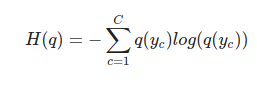
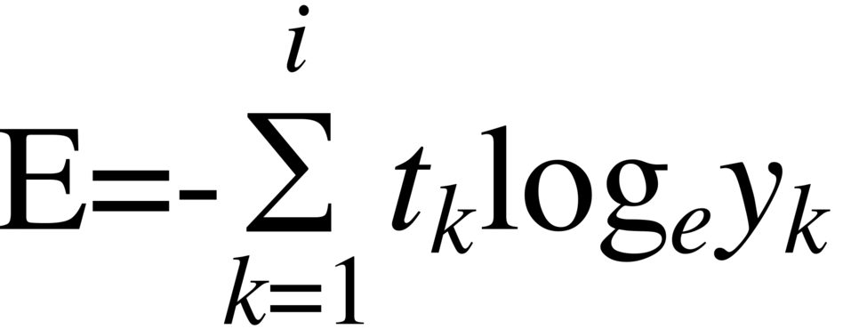

# Cross-Entropy

## **Entropy**
entropy란 불확실성에 대한 척도이다. 예측 모형으로 하고자 하는 것은 불확실성을 제어하고자 하는 것이다.
어떤 사건이 같은 비율로 발생한다고 가정할때, 사건의 갯수를 n이라고 하면 entropy는 log(n)이다. 하지만 다른 비율로 발생할 경우가 더 많으며 다음과 같은 수식으로 구할 수 있다.
  
이 때, C는 범주의 갯수이고, q는 사건의 확률질량함수 (probability mass function) 이다. 예를 들어, 가방 안에 빨간공과 녹색공이 20:80 으로 들어있는 경우, H(q)=-(0.2log(0.2)+0.8log(0.8))=0.5 이다. 더욱 쉬운 이해를 위해 가방에서 공을 꺼낼 때, 더 많은 경우의 수가 존재한다고 해보자. 가령 100개의 각기 다른 색깔과 모양의 공이 가방 안에 들어있다. 이 경우, 가방에서 공을 꺼냈을 때 어떤 색과 모양을 갖는 공이 관찰될지 알기 매우 힘들다. 각 공이 동일한 확률로 관찰된다고 가정할 때 entropy = log(100) = 4.6 이다. 하지만 100개의 공이 들어있다고 하더라도, 한 종류의 공이 99 %를 차지하고 있으면 어떨까? 이 경우, 위 식에 의해 entropy는 매우 작아진다 (-(0.99*log(0.99)+99*(0.01/99*log(0.01/99))) = 0.1). 즉, entropy 는 예측하기 쉬운 일에서보다, 예측하기 힘든일에서 더 높다.(즉, Entropy의 결과가 높을 수록 예측하기 힘듦을 뜻한다.)

## **Cross-Entropy**

예측 모형은 실제 분포인 q 를 모르고, 모델링을 하여 q 분포를 예측하고자 하는 것이다. 예측 모델링을 통해 구한 분포를 p(x)라고 한다.  
q와 p가 모두 식에 들어가기 때문에, cross-entropy 라는 이름이 붙었다고 할 수 있다. 머신러닝을 통한 예측 모형에서 훈련 데이터에서는 실제 분포인 p 를 알 수 있기 때문에 cross-entropy 를 계산할 수 있다. 즉, 훈련 데이터를 사용한 예측 모형에서 cross-entropy 는 실제 값과 예측값의 차이 (dissimilarity) 를 계산하는데 사용할 수 있다는 것이다.

