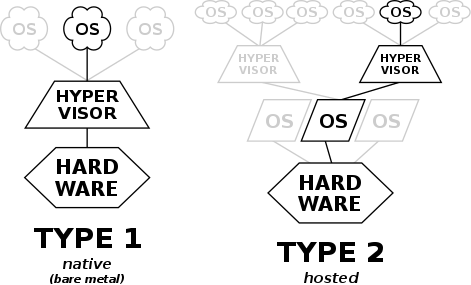

# Docker Intro

기존의 가상화 기술은 하이퍼바이저나 Guest OS를 이용해 여러 개의 운영체제를 하나의 호스트에서 생성해 사용하는 방식이었다.
- Host OS 방식 가상화: VirtualBox
- 하이퍼바이저 방식 가상화: VMware

  

하지만 각종 시스템 자원을 가상화하고 독립된 공간을 생성하는 작업은 하이퍼바이저를 반드시 거치기 때문에 일반 호스트에 비해 성능 손실이 발생한다. 또한, VM은 Guest OS를 사용하기 위한 라이브러리, 커널 등을 전부 포함하기 때무에 가상 머신을 배포하기 위한 이미지로 만들었을 때 이미지의 크기 또한 커진다.  

이에 비해 Docker Container는 가상화된 공간을 생성하기 위해 리눅스 자체 기능인 chroot, namespace, cgroup을 사용함으로써 프로세스 단위의 격리 환경을 만들기 때문에 성능 손실이 거의 없다. 애플리케이션을 구동하는 데 필요한 라이브러리 및 실행 파일만 존재해 가볍다.

## Docker Installation
### Ubuntu 18.04
```bash
$ curl -fsSL https://download.docker.com/linux/ubuntu/gpg | sudo apt-key add -

$ add-apt-repository "deb [arch=amd64] https://download.docker.com/linux/ubuntu $(lsb_release -cs) stable"

$ sudo apt-get update
$ sudo apt-get install docker-ce

$ sudo systemctl status docker
● docker.service - Docker Application Container Engine
   Loaded: loaded (/lib/systemd/system/docker.service; enabled; vendor preset: enabled)
   Active: active (running) since Wed 2021-07-21 21:06:59 KST; 26s ago
     Docs: https://docs.docker.com
 Main PID: 18799 (dockerd)
    Tasks: 12
   CGroup: /system.slice/docker.service
           └─18799 /usr/bin/dockerd -H fd:// --containerd=/run/containerd/containerd.sock

 7월 21 21:06:58 sh dockerd[18799]: time="2021-07-21T21:06:58.740395554+09:00" level=warning
 7월 21 21:06:58 sh dockerd[18799]: time="2021-07-21T21:06:58.740402270+09:00" level=warning
 7월 21 21:06:58 sh dockerd[18799]: time="2021-07-21T21:06:58.740405349+09:00" level=warning
 7월 21 21:06:58 sh dockerd[18799]: time="2021-07-21T21:06:58.740568807+09:00" level=info ms
 7월 21 21:06:58 sh dockerd[18799]: time="2021-07-21T21:06:58.876223909+09:00" level=info ms
 7월 21 21:06:59 sh dockerd[18799]: time="2021-07-21T21:06:59.052489458+09:00" level=info ms
 7월 21 21:06:59 sh dockerd[18799]: time="2021-07-21T21:06:59.115264150+09:00" level=info ms
 7월 21 21:06:59 sh dockerd[18799]: time="2021-07-21T21:06:59.115388878+09:00" level=info ms
 7월 21 21:06:59 sh systemd[1]: Started Docker Application Container Engine.
 7월 21 21:06:59 sh dockerd[18799]: time="2021-07-21T21:06:59.151732796+09:00" level=info ms
```

### Ubuntu 20.04
```bash
$ apt update & apt upgrade
$ sudo apt-get install apt-transport-https ca-certificates curl gnupg-agent software-properties-common
$ curl -fsSL https://download.docker.com/linux/ubuntu/gpg | sudo apt-key add -
$ sudo add-apt-repository "deb [arch=amd64] https://download.docker.com/linux/ubuntu $(lsb_release -cs) stable"

$ sudo apt-get update && sudo apt-get install docker-ce docker-ce-cli containerd.io
$ sudo systemctl enable docker && service docker start
```
