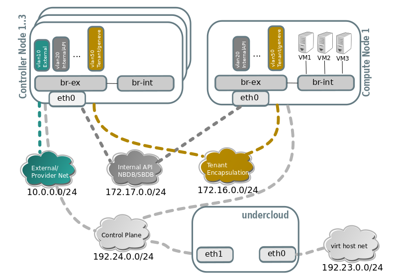

## **Horizon(Dashboard)**
사용자가 웹 UI를 통해 인스턴스 생성, 삭제 및 관리 등을 쉽고 빠르게 처리할 수 있도록 해 주는 웹 서비스이다. Horizon은 아파치 웹 서버를 사용하며, 대시보드는 파이썬 장고 프레임워크으로 구현이 되어 있다.  

Horizon은 단순히 자체 모듈만 가지고 있다. 그러나, 모든 서비스의 API와 연동하여 사용자에게 Web 서비스를 제공하는 구조로 되어 있다.

> TripleO의 Undercloud, Overcloud-Controller에 모두 설치 되고, 인스턴스 생성 및 삭제, 관리는 Undercloud의 Horizon에서 수행된다.

## **Glance(image)**
Glance는 다양한 하이퍼바이저에서 사용할 수 있는 가상머신 이미지를 관리하고, 가상머신에 설치된 운영체제를 보관 및 관리합니다.  

- Glance API를 통해 이미지를 동록, 삭제 및 관리를 할 수 있다.
- glance-api는 glance-registry와 glance database에서 이미지가 관리된다. 
- 이미지를 등록할 때는 glance-registry를 통해 glance-database에 저장이 된다.
- 등록된 이미지를 사용할 때는 glance-database에 바로 사용요청을 한다.

> TripleO에서 Glance는 Undercloud와 Overcloud-Controller에 모두 설치 된다. Undercloud에서는 Overcloud 배포를 위한 이미지가 저장되고, Overcloud-Controller에는 인스턴스를 만들 때 필요한 이미지를 저장한다.

## **Nova(compute)**
- Nova는 Dashboard나 커맨드 라인 명령어가 호출하는 nova-api로부터 시작된다. 
- nova-api는 Queue를 통해 nova-compute에 인스턴스를 생성하라는 명령어를 전달한다. 
- 인스턴스 생성 명령어를 전달받은 nova-compute는 하이퍼바이저 라이브러리를 통해 하이퍼바이저에게 인스턴스를 생성하라는 명령어를 다시 전달합니다. 
- 하이퍼바이저는 인스턴스를 생성하게 된다. 
- 생성된 인스턴스는 nova-console를 통해 사용자가 접근할 수 있게 된다.

nova가 지원하는 hypervisor는 그룹이 3개가 있다.
1. Qemu-KVM
2. Hyper-V, VMware, XenServer6.2
3. Baremetal, docker, Xen via libvirt, LXC via libvirt

**nova-api service**  
end user의 compute API 호출을 허용하고 응답합니다. 이 서비스는 admin User가 관리작업을 수행할 수 있도록 OpenStack Compute API, Amazon EC2 API등의 API를 지원합니다. 인스턴스를 실행하고 관리 제어하는 역할을 담당합니다.

**nova-compute service**  
하이퍼바이저 API를 통해 VM 인스턴스를 생성하고 종료하는 데몬입니다. 하이퍼바이저는 XenServer / KVM / VMWare등이 있습니다.

**nova-scheduler service**  
queue에서 VM 인스턴스의 Request를 가져와 가상 시스템이 실행되는 Compute 서버 노드를 결정합니다.

**nova-conductor module**  
nova-compute service와 데이터베이스 간의 상호 작용을 관리합니다.

**nova-cert module**  
X509 인증용 nova 인증서 서비스를 제공합니다. EC2 API에서만 필요합니다.

**nova-novncproxy daemon**  
VNC 연결을 통해 실행 중인 인스턴스에 액세스하는 프록시를 제공합니다. 브라우저 기반 novnc 클라이언트를 지원합니다.

> TripleO에서  Nova는 Ironic, Neutron과 함께 배포할 노드에 hardware configuratrion을 provisioning하는 역할을 한다.  

## **Keystone(certification)**
Keystone은 사용자 인증을 통하여 물리 서버내의 자원을 사용할 수 있도록 관리합니다. 오픈스택 내의 자원을 아무나 들어와서 쓰는 것이 아닌 인증을 받은 구성원만 들어와서 쓸 수 있도록 하는 역할이다.

논리 아키텍처에서의 Keystone은 서비스 및 관리자 API, Token Backend, Catalog Backend, Policy Backend, Identity Backend로 구성이 됩니다.
- Token Backend는 사용자 별 Token을 관리합니다.
- Catalog Backend는 오픈스택의 모든 서비스의 End-point URL을 관리합니다.
- Policy Backend는 테넌트, 사용자 계정 및 롤 등을 관리합니다.
- Identity Backend를 통하여 사용자 인증을 관리합니다.

오픈스택에서 Keystone은 모든 서비스를 관장하는 위치에 자리를 하고 있다. Keystone은 타인이나 해커로부터 시스템을 안전하게 보호하고, 사용자 등록 및 삭제, 권한 관리, 사용자가 접근할 수 있는 서비스 포인트 관리까지 사용자 인증에 대한 모든 관리를 Keystone이 수행하고 있다.

#### **Tenent, User, Role**
사용자일 경우에는 사용자 그룹인 Tenant, 사용자 계정 정보인 User ID와 PW, 사용자 권한인 Role을 가진다. 서비스일 경우에는 서비스를 등록하고 해당 서비스의 Endpoint URL을 등록한다.
- Tenant에는 User가 포함됩니다.
- User는 Role을 가지고 있습니다.
- Token을 발행할 때는 Tenant와 User 정보가 필요합니다.
- 서비스가 있고, 각각의 서비스는 Endpoint URL을 가집니다.
- User는 Endpoint URL을 통해 서비스에 접근합니다.

> Undercloud의 Keystone에는 deploy할 노드들의 정보가 등록되어 있고, Overcloud-Controller의 Keystone은 사용자들이 인스턴스를 생성할때의 tenent, user, role을 등록하기 위함이다.

## **Neutron(Network)**
Neutron server, agent, plug-in, MQ, network provider, database로 구성이 되어 있습니다. 또한 Neutron은 다양한 네트워크 플러그인과 네트워크 모델을 지원합니다. 
- 사용자는 Neutron API를 이용하여 Neutron 서버로 IP를 할당을 요청한다.
- Neutron 서버는 들어온 요청을 Queue로 다시 요청한다.
- Queue는 Neutron 에이전트와 플러그인으로 IP 할당 지시를 내린다.
- Neutron 에이전트와 플러그인은 지시 받은 작업을 데이터베이스에 저장한다.
- Neutron 에이전트는 네트워크 프로바이더에게 작업을 지시한다.
- 그리고, 수시로 작업상태를 데이터베이스에 업데이트한다.
- 이제 할당된 IP를 인스턴스에서 사용할 수 있다. 
Neutron이 네트워킹 기능을 하는 것이 아니라 Neutron과 연결된 다른 네트워크 프로바이더에 의해 네트워킹 된다.

  
다음은 Hypervisor별 지원하는 plug-in 정보이다.

오픈스택의 기본 Hypervisor는 QEMU-KVM이고, 그에 따른 다양한 plug-in을 지원하고 있다.

Neutron은 다음과 같이 노드 별로 구성되어 있다.

> Neutron의 TripleO architecture 구성은 다음과 같이 확인할 수 있다. Undercloud에서의 Neutron의 역할은 등록될 노드의 IP주소를 맵핑해주고 Overcluod-Controller의 Neutron은 생성되는 인스턴스에 IP를 맵핑해주는 역할을 한다.

## **Ironic(baremetal)**
Ironic은 베어메탈(가상이 아닌) 머신을 프로비저닝하는 OpenStack 프로젝트다. 독립적으로 또는 OpenStack Cloud의 일부로 사용할 수 있으며 OpenStack Identity(keystone), Compute(nova), Network(neutron), Image(glance) 및 Object(swift) 서비스와 통합된다.

베어메탈 서비스는 공통(예: PXE 및 IPMI) 및 공급업체별 원격 관리 프로토콜을 통해 하드웨어를 관리한다. 클라우드 운영자에게 이기종 서버 플릿에 대한 통합 인터페이스를 제공하는 동시에 컴퓨팅 서비스에 물리적 서버를 가상 머신처럼 관리할 수 있는 인터페이스를 제공한다.

## **Heat(orchestration)**
Orchestration 서비스는 동작하는 클라우드 어플리케이션을 구동시키기 위해 OpenStack API 호출들을 수행함으로써, 클라우드 어플리케이션을 서술하는 템플릿에 기반한 오케스트레이션 기능을 제공한다. OpenStack의 다른 핵심 구성 요소들을 단일 파일 템플릿 시스템에 통합시킨다. 템플릿을 통하여 인스턴스, 유동 IP, 볼륨, 보안 그룹과 사용자 등의 대부분 OpenStack 자원 유형을 생성할 수 있다. 또한 템플릿은 인스턴스 고가용성, 인스턴스 자동스케일링, 그리고 중첩 스택 등과 같은 고급 기능을 제공하기도 한다. 이것은 OpenStack 코어 프로젝트들이 더 큰 사용자층을 받아들일 수 있도록 합니다.

**heat command-line client**  
AWS CloudFormation API를 실행하기 위해 hot-api와 통신하는 cli입니다. 최종 개발자는 오케스트레이션 REST API를 직접 사용할 수 있습니다.

**heat-api component**  
RPC(원격 프로시저 호출)를 통해 heat-engine에 API 요청을 전송하여 처리하는 OpenStack 네이티브 REST API입니다.

**heat-api-cfn component**  
AWS CloudFormation과 호환되는 AWS Query API입니다. RPC를 통해 heat-engine을 통해 API 요청을 처리합니다.

**heat-engine**  
템플릿 시작을 조정하고 API consumer에게 다시 이벤트를 제공합니다.

> Heat는 hot템플릿을 이용해 Undercloud에서 오픈스택 리소스들(Nova, Ironic, Neutron 등.)을 생성하는 역할을 한다.

# TripleO / Ansible Sequence Diagram

