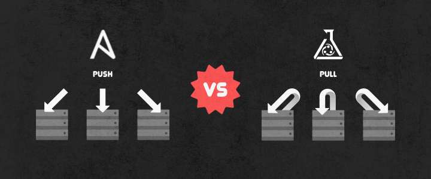

# Puppet & Ansible

Anisble과 Puppet은 모두 시스템 환경 설정 자동화 툴이다. 시스템 자동화 툴의 이점은 여러 대의 서버에서 같은 작업들을 해야할 때나, 같은 환경에서 이전에 한 설정을 배포할 때 유용하다.

Openstack에서 advanced된 deploy 방법(TripleO, Kolla-Ansible...)에서는 컨테이너를 이용해 환경을 구성하게 한다. 이 컨테이너를 띄우는 과정에서 자동화 툴인 Ansible, Puppet을 사용하게 되는 것이다. 

가장 큰 차이점은 Puppet은 master(provisioning을 하게 되는 노드) pull방식이고, Ansible은 master push방식이다.
좀 더 자세히 말하면 Puppet은 client에 puppet agent가 설치되어 지속적으로 master 노드에서 업데이트 할 정보가 없는지 찾는 것이고, Ansible은 master에서 ansible-playbook을 통해 업데이트 시키는 방식이다
> 두 방법 모두 멱등성을 보장한다.

# TripleO에서의 적용

`TripleO`를 설치하다 보면 Ansible과 Puppet모두 이용하는 것을 볼 수 있는다. 그 이유는 Train이전 버전까지는 Puppet을 이용해 자동화를 했지만, 이후 Ansible로 교체하는 과정을 거쳤다. 하지만 모든 부분을 교체하기엔 양이 너무 방대해 조금씩 수정해 나가는 방식이고, Ansible이 Puppet을 호출하는 방식으로 이를 해결해 나가고 있다.

> Undercloud deploy, Overcloud Baremetal Configuration, Overcloud deploy 전 과정에서 ansible-playbook이 사용되는 것을 볼 수 있다.
