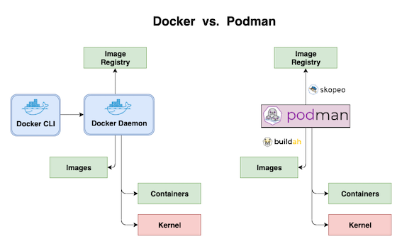

# Docker vs Podman

Docker와 Podman의 차이는 daemon을 이용하냐 안하냐의 차이다. Docker는 daemon을 사용해 docker registry, doker container 등이 컨테이너를 만들어내고, podman은 컨테이너 하나를 만들때마다 하나의 프로세스로서 작동을 하게된다.

Podman이 daemon을 사용하지 않음으로써 얻는 이점은 docker처럼 daemon에 장애가 발생시(예를 들어 메모리 누수) 모든 컨테이너가 죽지 않는다는 점이 있다.

> 사용방법은 도커와 같다.